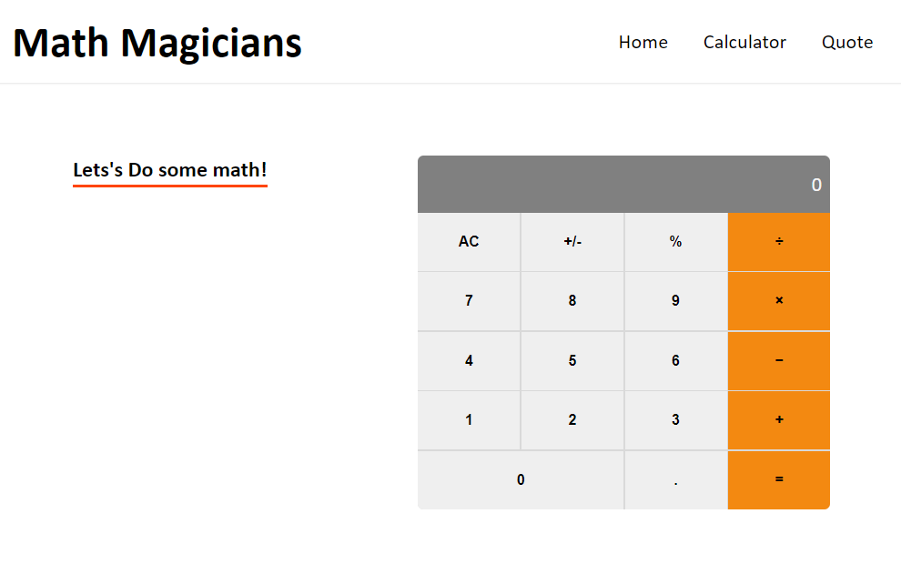

# Math Magicians

> "Math magicians": It is a Single Page App (SPA) that allows users to make simple calculations

## Built With

- ReactJS
- React Router

## 🔗 [Live Link](https://mrbrn197.github.io/Math-Magicians)

[](https://mrbrn197.github.io/Math-Magicians)

## Getting Started

To get a local copy up and running follow these simple example steps.

```
git clone https://github.com/MrBrN197/Math-Magicians.git
cd Math-Magicians
npm install
```

and then to start a live server run

```
npm start
```

## Installation

to build a production version to `bulid` folder run

```
npm run build
```

## Authors

👤 **Brian Orora**

- GitHub: [@MrBrN197](https://github.com/MrBrN197)
- Twitter: [@MrBrN197](https://twitter.com/MrBrN197)
- LinkedIn: [LinkedIn](https://www.linkedin.com/in/brian-orora-2b7883a7/)

## 🤝 Contributing

Contributions, issues, and feature requests are welcome!

Feel free to check the [issues page](../../issues/).

## Show your support

Give a ⭐️ if you like this project!
